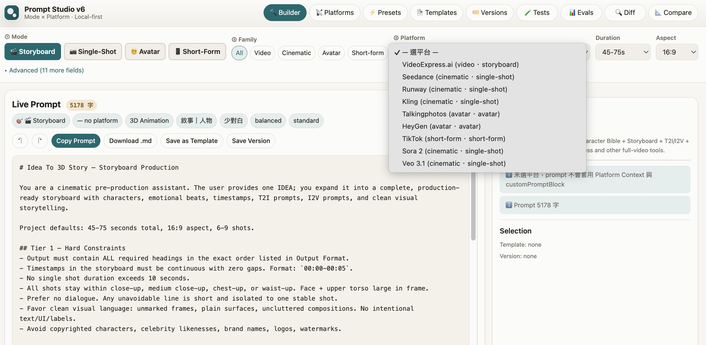

<div align="center">

# PromptStudio

[](LICENSE)
[]()
[]()
[]()
[](https://github.com/notoriouslab/prompt-studio)

**Turn one idea into production-ready prompts for AI video tools.**

Sora 2 · Veo 3.1 · Runway · Kling · Seedance · VideoExpress · Talkingphotos · HeyGen · TikTok · single-file HTML · local-first · no build · no account

[繁體中文](./README.zh-TW.md)



</div>

---

## Why PromptStudio?

Writing prompts for AI video tools is messy. Each platform has its own syntax (Sora 2 wants structured sections; Veo 3.1 wants `Subject + Context + Action + Mood`; Kling wants `Anchor + Environment + Action + Camera`). Characters drift between shots. Chinese dialogue gets rendered as floating subtitles. Switching platforms means rewriting from scratch.

PromptStudio bakes platform-specific best practices into an orthogonal **Mode × Platform × Domain × MediaType** matrix. Pick the combination, fill in the idea, get a system prompt — feed it to your LLM (Claude / GPT / Gemini) and the LLM expands it into a production-ready storyboard or single-shot script you can paste straight into the video-gen tool.

### Three differentiators

| Feature | How it works |
|---|---|
| **Platform-aware syntax** | Each of 9 platforms carries its own `customPromptBlock` reflecting 2026 official prompt guides. What you generate matches what the model actually wants — no more rewriting between Sora and Runway. |
| **Cross-shot identity safety** | Built-in **Actor Alias dual-track** convention (`Actor 1, the 50-year-old host in a dark blue suit`) anchors character identity to visual traits, not names. Dialogue gets wrapped as a speech act (`says in a confident, clear Mandarin accent: "..."`) so Chinese lines route to TTS rather than appearing as on-screen subtitles. |
| **Two-layer regression-tested** | L1 snapshot tests (14 cases) guarantee spec byte-stability. L2 LLM eval (5 cases, regex assertions, free Gemini tier) verifies the rules actually land with a real LLM. Reproducible baselines ship in [`samples/eval/`](./samples/eval/). |

---

## Quick Start

1. Clone or download [`prompt-studio.html`](https://raw.githubusercontent.com/notoriouslab/prompt-studio/main/prompt-studio.html)
2. Open it in any modern browser — no install, no server, no account
3. Pick **Mode** / **Platform** / **Domain** / **MediaType**, fill in your idea
4. Copy the generated prompt → feed it to your LLM → paste the LLM output into the video-gen tool

```bash
git clone https://github.com/notoriouslab/prompt-studio.git
open prompt-studio/prompt-studio.html
```

---

## Supported Platforms

| Platform | Family | Primary mode | Highlight |
|---|---|---|---|
| **Sora 2** | cinematic | single-shot / storyboard | OpenAI; native audio sync, character refs, up to 20s |
| **Veo 3.1** | cinematic | single-shot | Google; `Subject + Context + Action + Mood`, native SFX |
| **Runway Gen-4.5** | cinematic | single-shot | strong camera vocabulary, positive-only prompting |
| **Kling 3.0** | cinematic | single-shot | character action; 2-3 trait cap for identity stability |
| **Seedance 2.0** | cinematic | single-shot | ByteDance; Semantic Weighting `((keyword))` |
| **VideoExpress.ai** | video | storyboard | full pipeline (6-9 shots) |
| **Talkingphotos** | avatar | avatar | image + TTS lipsync |
| **HeyGen** | avatar | avatar | 175+ languages, voice tuning |
| **TikTok / Douyin** | short-form | short-form | 9:16 vertical hook |

## Supported Content Types

**4 modes × 8 domains × 4 mediaTypes**:

| Domain | Use case |
|---|---|
| `narrative-character` / `narrative-scene` | drama, epic, fiction |
| `real-interview` / `real-report` | KOL interview, documentary |
| `product-demo` | e-commerce, unboxing |
| `educational` | tutorials, knowledge content |
| `lifestyle-vlog` | travel, food, pet |
| `editorial-cinemagraph` | living poster, subtle-motion poster |

MediaType: **3D Animation** / **Live Action** / **2D Animation** / **Illustration**

Mode: **Storyboard** (full / minimal) / **Single-Shot** / **Avatar** / **Short-Form**

---

## Features

### Live prompt preview
The "Real-time Prompt" pane updates as you change any field.

### Output modes
Storyboard mode has two output styles — **Full** (8 sections including Character Bible, Emotional Arc, Continuity Lock) for production review, or **Minimal** (2 sections, paste-ready) aligned with VideoExpress's compact format.

### Template + version management
Save / load builder presets, track multiple versions per template.

### Keyboard shortcuts
| Key | Action |
|---|---|
| `Cmd/Ctrl + Z` | Undo builder changes |
| `Cmd/Ctrl + Shift + Z` / `Ctrl + Y` | Redo |
| `Cmd/Ctrl + S` | Save Version (template selected) |

### Bilingual UI
🌐 EN / 中 toggle (bottom of Advanced section).

### Custom rules
Add per-session rules that layer on top of Tier 3 style hints.

### Local-first
All state lives in `localStorage`. No cloud, no account, no server.

---

## Validation

Two automated layers + one manual layer:

| Layer | Validates | Tool | Cost |
|---|---|---|---|
| **L1** | Spec text byte-stability | `snapshot-test.js` (14 cases) | Free / instant |
| **L2** | LLM follow-through on spec rules | `eval.js` (Gemini 2.0 Flash + regex assertions) | Free (Gemini free tier) |
| **L3** | Real video-gen output matches intent | Human dogfood + reference | Real video-gen credits |

[`samples/eval/`](./samples/eval/) ships baseline Gemini outputs from L2 — concrete proof that spec rules take effect when fed to a real LLM.

```bash
node snapshot-test.js              # L1 (no API key needed)
node eval.js                       # L2 (GEMINI_API_KEY required)
```

Get a free `GEMINI_API_KEY` from [Google AI Studio](https://aistudio.google.com/apikey). `eval.js` reads it from `~/.paiop_secrets.json` by default.

---

## Privacy

| Thing | Where it lives |
|---|---|
| Builder state, templates, versions | Browser `localStorage` only |
| Generated prompts | In-memory only |
| LLM expansion | Your choice of LLM; PromptStudio doesn't call any LLM itself |
| Validation eval | Optional, runs on your machine with your own `GEMINI_API_KEY` |

No analytics. No telemetry. No cloud sync. No account.

---

## Design Principles

- **Mode × Platform orthogonality** — mode shapes scaffolding, platform injects syntax
- **Rule once-only** — every rule lives in exactly the highest-weight Tier
- **Local-first** — `localStorage` only, zero cloud
- **Single-file** — one HTML, no build pipeline, no module resolution

---

## Contributing

Spec rule changes should keep both validation layers green:

```bash
node snapshot-test.js && node eval.js
```

New platform / domain / mediaType: edit the corresponding const in `prompt-studio.html` (`db.platforms` / `DOMAINS` / `MEDIATYPES`). They are single sources of truth — one edit propagates to the HTML form, i18n, rule lookups, and the prompt() hint.

---

## License

[MIT](./LICENSE) © 2026 notoriouslab
